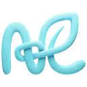

<p align="center">
  
</p>

<h1 align="center">NaturalLink Regression Check</h1>

<p align="center">
  <strong>Catch unintended UI regressions before they ship</strong><br/>
  AI writes code fast — but can't see what it broke. We can.
</p>

<p align="center">
  <a href="https://github.com/NaturalLink-AI/regression-check-github-action/actions/workflows/ci.yml"></a>
  <a href="https://github.com/NaturalLink-AI/regression-check-github-action/actions/workflows/codeql.yml"></a>
  
  <a href="https://github.com/NaturalLink-AI/regression-check-github-action/blob/main/LICENSE"></a>
  <a href="https://github.com/NaturalLink-AI/regression-check-github-action/releases"></a>
</p>

<p align="center">
  <a href="https://naturallink.ai">Website</a> •
  <a href="https://dashboard.naturallink.ai">Dashboard</a> •
  <a href="#usage">Usage</a> •
  <a href="#features">Features</a> •
  <a href="#support">Support</a>
</p>

---

A GitHub Action by [NaturalLink](https://naturallink.ai) that detects unintended
UI regressions in your pull requests — the visual side effects that slip through
code review.

## The Problem

AI tools like Cursor and Copilot generate code fast. But they can't see your UI.
A PR that "just adds a button" might accidentally:

- Break the layout on mobile
- Shift elements on unrelated pages
- Cause visual inconsistencies in edge states

**Code review catches logic bugs. This action catches visual regressions.**

## Features

- **Regression Detection** — Find unintended UI side effects unrelated to PR
  goals
- **Visual Context** — See what broke, not just what changed
- **AI-Generated PR Support** — Built for the age of Cursor, Copilot, and
  agentic coding
- **Automatic PR Comments** — Regression reports posted directly to your pull
  request
- **Zero Configuration** — Works with your existing app, no SDK required
- **Fast Feedback** — Get results in seconds, not minutes

## Prerequisites

Before using this action, you'll need to complete the following steps:

### 1. Request Access on Natural Link

Request Access at [naturallink.ai](https://naturallink.ai) to get started.

### 2. Obtain an API Key

Once signed up, obtain an API key from the
[Dashboard](https://dashboard.naturallink.ai). This key allows the action to
communicate with our servers.

### 3. Store the API key as a GitHub Secret

Add your NaturalLink API key as a secret in your GitHub repository (or
organization):

1. Go to your repository on GitHub
2. Navigate to **Settings** → **Secrets and variables** → **Actions**
3. Click **New repository secret**
4. Set the name to `NATURALLINK_API_KEY`
5. Paste your API key as the value
6. Click **Add secret**

> For organization-wide usage, you can add the secret at the organization level
> under **Organization Settings** → **Secrets and variables** → **Actions**.

## Usage

Add the following workflow file to your repository at
`.github/workflows/regression-check.yml`:

```yaml
name: NaturalLink Regression Check

on:
  pull_request:
    types: [opened, synchronize]

jobs:
  regression-check:
    name: Regression Check
    runs-on: ubuntu-latest
    steps:
      - name: Run NaturalLink Regression Check
        id: regression-check
        uses: NaturalLink-AI/regression-check-github-action@v0.3.0
        with:
          api-key: ${{ secrets.NATURALLINK_API_KEY }}
```

## Inputs

| Input     | Required | Description                                                                     |
| --------- | -------- | ------------------------------------------------------------------------------- |
| `api-key` | Yes      | Your NaturalLink API key from the [Dashboard](https://dashboard.naturallink.ai) |

## Outputs

| Output                 | Description                                                          |
| ---------------------- | -------------------------------------------------------------------- |
| `status`               | The status of the regression check (`success`, `failure`, `warning`) |
| `report-url`           | URL to the full regression report                                    |
| `regressions-detected` | Whether unintended visual regressions were found (`true`, `false`)   |

## Examples

### Basic Usage

```yaml
- name: Run Regression Check
  uses: NaturalLink-AI/regression-check-github-action@v0
  with:
    api-key: ${{ secrets.NATURALLINK_API_KEY }}
```

### With Status Check

```yaml
- name: Run Regression Check
  id: regression
  uses: NaturalLink-AI/regression-check-github-action@v0
  with:
    api-key: ${{ secrets.NATURALLINK_API_KEY }}

- name: Check Results
  if: steps.regression.outputs.regressions-detected == 'true'
  run: echo "Unintended UI regressions detected! Review the report."
```

## Compatibility

| Platform            | Supported |
| ------------------- | --------- |
| GitHub Actions      | ✅        |
| GitHub Enterprise   | ✅        |
| Self-hosted runners | ✅        |

| Runner OS | Supported |
| --------- | --------- |
| Ubuntu    | ✅        |
| macOS     | ✅        |
| Windows   | ✅        |

## Support

- **Documentation**: [docs.naturallink.ai](https://docs.naturallink.ai)
- **Issues**:
  [GitHub Issues](https://github.com/NaturalLink-AI/regression-check-github-action/issues)
- **Email**: contact@naturallink.ai

## Security

This action requires an API key to communicate with NaturalLink servers. Always
store your API key as a
[GitHub Secret](https://docs.github.com/en/actions/security-guides/encrypted-secrets)
and never commit it to your repository.

For security vulnerabilities, please email contact@naturallink.ai.

## Contributing

Contributions are welcome! Please see our
[Contributing Guidelines](CONTRIBUTING.md) for details.

## License

This project is licensed under the MIT License - see the [LICENSE](LICENSE) file
for details.

---

<p align="center">
  Built with ❤️ by <a href="https://naturallink.ai">NaturalLink</a>
</p>
